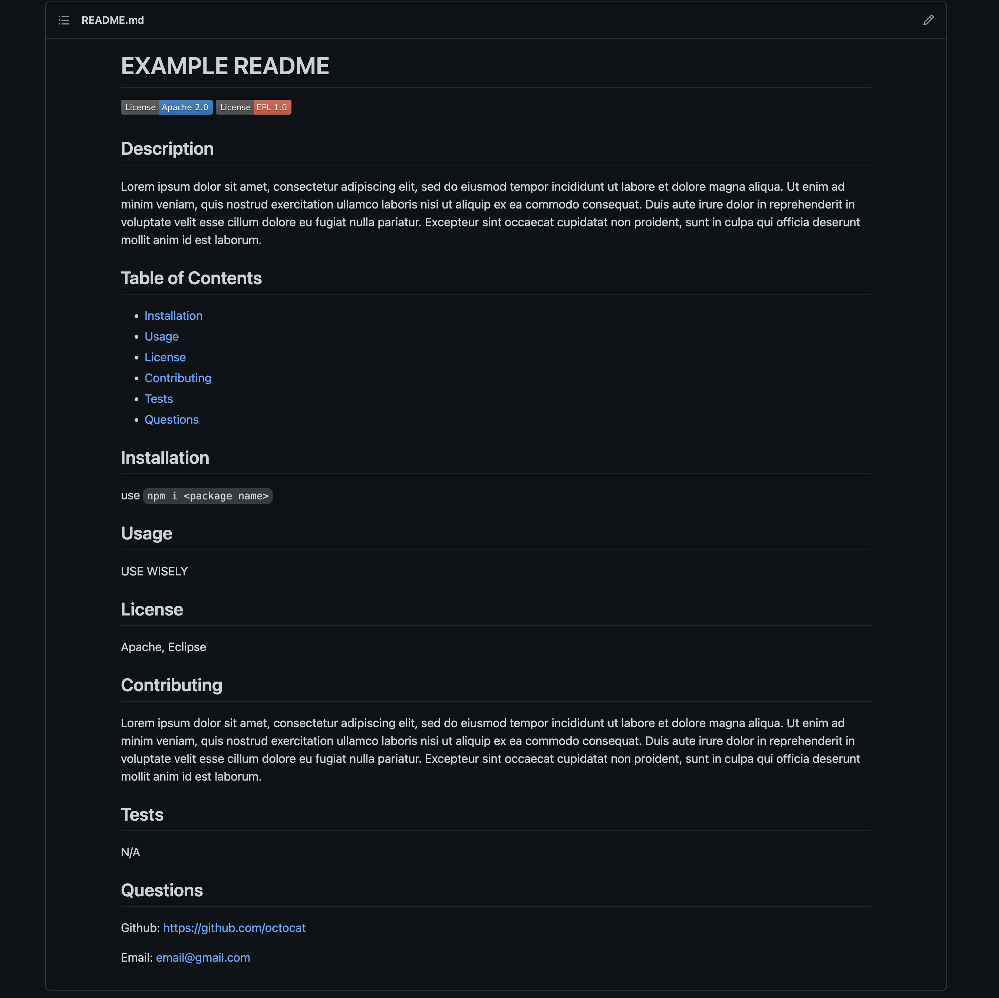

  # Jacob Canepa's ReadMe Generator

  ## Description
  A command line application that generates a professional readme based on user's input.

  ## Table of Contents
  - [Installation](#installation)
  - [Usage](#usage)
  - [Questions](#questions)

  ## Installation
  PLEASE fork repo before cloning!
  ```
  npm install
  ```
  See walkthrough for more details...

  ## Usage
  To get started just type the command "node index" in the root directory's terminal...
  
  Walkthrough video: https://drive.google.com/file/d/1GScDuq2uqgpxY3xfYqAE3-Gn_DBC3RUu/view?usp=sharing 

  Output Example:
  

  ## Questions
  Github: https://github.com/jacobmcanepa
  
  Email: jacobmcanepa@gmail.com
  
  
